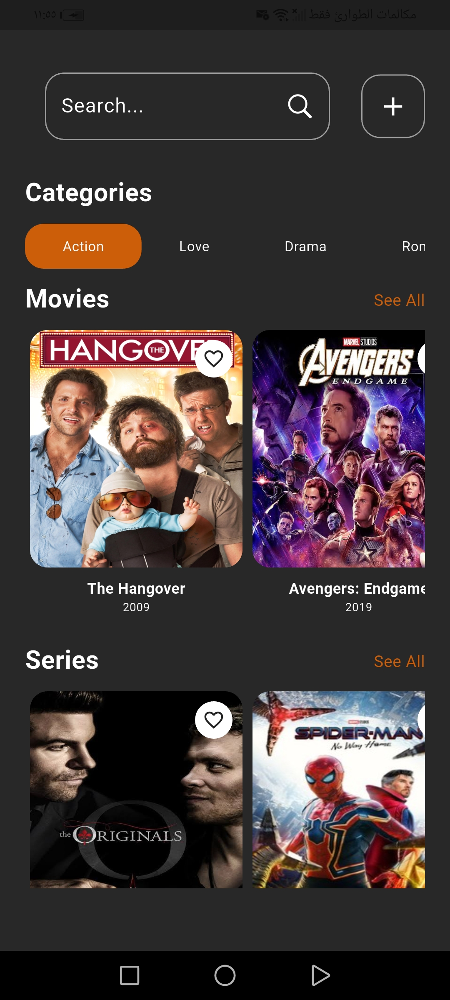
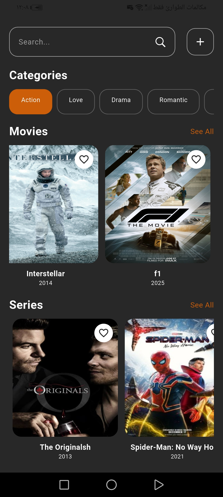
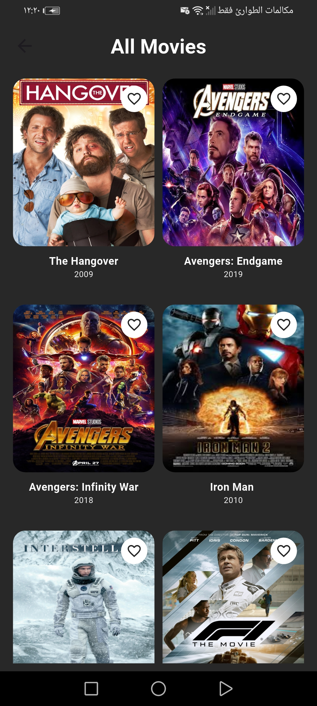
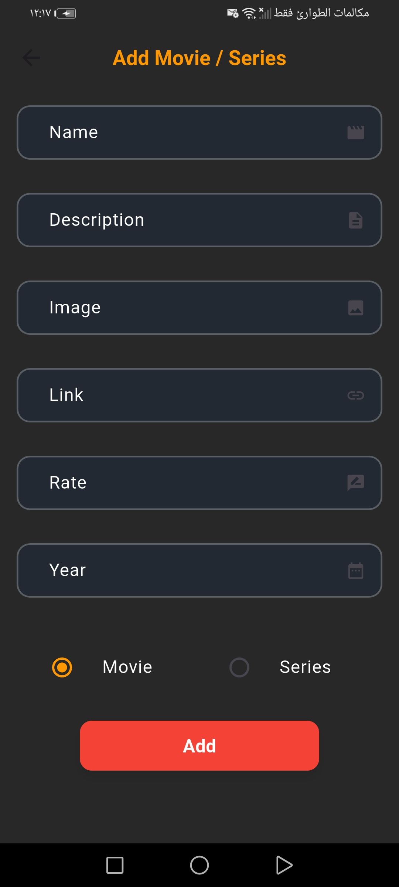
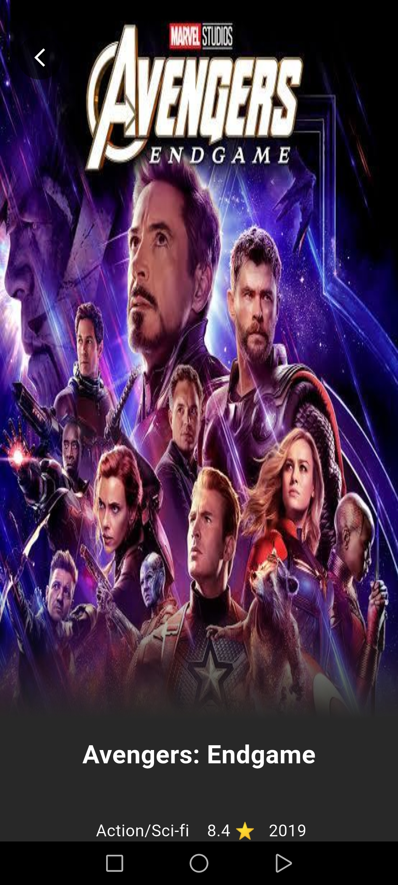

<div align="center">


<br/>


<br/>

> 🛍️ **A modern fashion shopping app** built with Flutter & Firebase — fast, elegant, and feature-rich.

⚠️ **Status: Under Active Development**

</div>

---

## 📱 App Screenshots

<div align="center">

### 🏠 Home Screen
 &nbsp;&nbsp; 

### 🎬 All Movies / Series
 &nbsp;&nbsp; 

### ➕ Add Screen


### 🗂️ Details Screens
 &nbsp;&nbsp; 


</div>

---

## 🎥 Demo Video

<div align="center">

[](https://drive.google.com/file/d/1hHhW3AyNSDLKl7uLXBHPPPlQt0wqp7Cb/view?usp=drivesdk)

</div>

---

## 🚀 Tech Stack

| Layer | Technology |
|---|---|
| 📱 **Frontend** | Flutter (Dart) |
| 🔥 **Backend** | Firebase |
| 🗄️ **Database** | Cloud Firestore |
| 🧠 **State Management** | Cubit (flutter_bloc) |
| 🏛️ **Architecture** | Clean Architecture |

---

## ✨ Features

- 🏠 **Home Feed** — Browse trending fashion items
- 🎬 **Movies & Series** — Explore categorized content
- 🗂️ **Item Details** — Rich detail pages with media
- ➕ **Add Items** — Upload new listings easily
- 🔥 **Real-time Sync** — Powered by Cloud Firestore
- ⚡ **Fast & Responsive** — Optimized Flutter UI

---

## 🏗️ Architecture

```
lib/
├── core/               # Shared utilities, constants, theme
├── data/               # Repositories, models, Firebase services
├── domain/             # Entities, use cases, abstract repos
└── presentation/       # Screens, Cubits, Widgets
```

> Follows **Clean Architecture** principles for scalability and testability.

---

## 🛠️ Getting Started

### Prerequisites

- Flutter SDK `>=3.0.0`
- Dart `>=3.0.0`
- Firebase project with Firestore enabled

### Installation

```bash
# 1. Clone the repository
git clone https://github.com/your-username/fusio_style.git

# 2. Navigate to the project
cd fusio_style

# 3. Install dependencies
flutter pub get

# 4. Configure Firebase
# Add your google-services.json (Android) and GoogleService-Info.plist (iOS)

# 5. Run the app
flutter run
```

---

## 📦 Key Dependencies

```yaml
dependencies:
  flutter_bloc: ^8.x       # Cubit state management
  firebase_core: ^2.x      # Firebase core
  cloud_firestore: ^4.x    # Firestore database
  firebase_auth: ^4.x      # Authentication
  cached_network_image: ^3.x # Image caching
```

---

## 🗺️ Roadmap

- [x] Home screen UI
- [x] All items listing
- [x] Detail pages
- [x] Add item screen
- [ ] Cart & Checkout
- [ ] User authentication
- [ ] Search & Filter
- [ ] Payment integration
- [ ] Push notifications

---

## 🤝 Contributing

Contributions are welcome! Please open an issue first to discuss what you'd like to change.

1. Fork the project
2. Create your feature branch (`git checkout -b feature/AmazingFeature`)
3. Commit your changes (`git commit -m 'Add some AmazingFeature'`)
4. Push to the branch (`git push origin feature/AmazingFeature`)
5. Open a Pull Request

---

## 📄 License

Distributed under the MIT License. See `LICENSE` for more information.

---

<div align="center">

Made with ❤️ using Flutter & Firebase

⭐ **Star this repo if you find it useful!**

</div>
